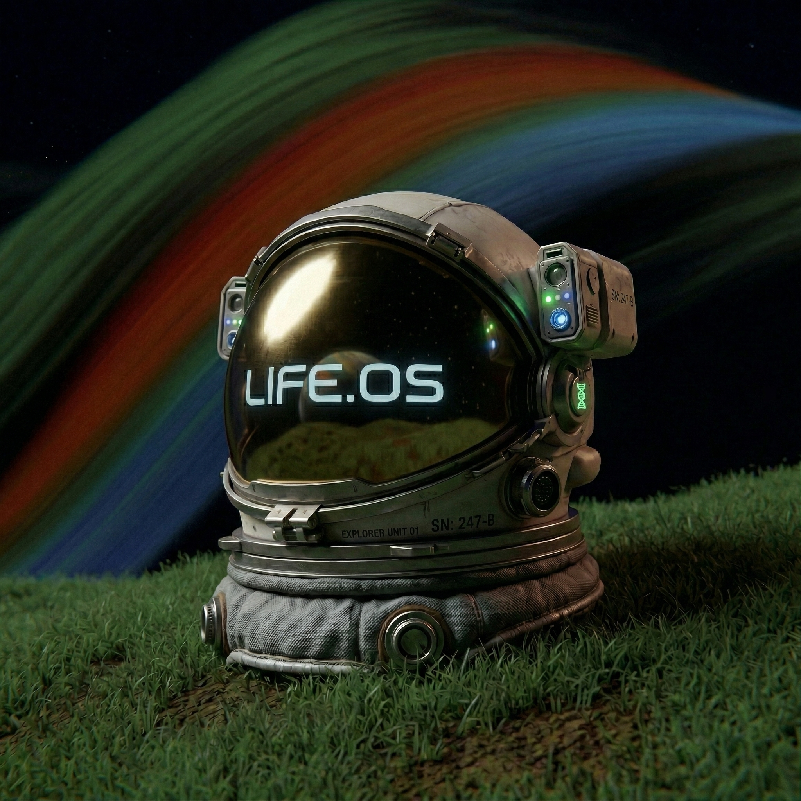

<div align="center">
  
  
  # Life.OS
  **Transform your daily routine into an epic RPG narrative.**
  
  [](https://flutter.dev)
  [](https://dart.dev)
  [](https://firebase.google.com/)
  [](https://deepmind.google/technologies/gemini/)

  ---
</div>

> **Life.OS** is an intelligent mobile application that transforms your daily life into an interactive RPG experience. Log your sleep, study hours, expenses, and mood, and let advanced AI analyze your behavior to chart your real-time stats—like Discipline, Health, and Focus.

## ✨ Experience Your Life as a Story

Life.OS leverages Large Language Models (LLMs) to write a daily chapter of your life story. Your narrative dynamically changes based on your consistent behavior:
* **Productive and Consistent?** Your story becomes an epic, inspiring adventure of growth.
* **Unproductive or Slacking?** Your narrative shifts into a darker, challenging tone to motivate you back on track.

## 🚀 Key Features

- **🎮 RPG RPG Gamification**: User data is intelligently transformed into evolving character stats. 
- **📈 Real-Time AI Analysis**: Generate visual behavioral reports and future predictions effortlessly from simple daily inputs.
- **🔮 Future Simulation**: Peek into the future! Simulate where you could realistically be 30 days from now based on your current habits.
- **⚔️ Daily Quests & Rewards**: An intelligent quest tracking and reward system built directly into your routine to enforce consistency.
- **🛡️ Secure & Synced**: Backed by Firebase for seamless and secure data management.

## 🛠 Tech Stack & Architecture

Built with scale and maintainability in mind, Life.OS follows strict **Clean Architecture** principles, enforcing a hard separation between data, domain logic, and presentation layers.

* **Framework:** Flutter / Dart
* **Backend:** Firebase (Auth, Firestore, Cloud Functions)
* **AI Engine:** Google Gemini API
* **State Management:** BLoC / Cubit
* **Routing:** GoRouter
* **Dependency Injection:** GetIt

## ⚙️ Getting Started

Follow these steps to get your local environment set up and running.

### Prerequisites
- [Flutter SDK](https://flutter.dev/docs/get-started/install) (Version 3.11.4 or higher)
- [Android Studio](https://developer.android.com/studio) or [VS Code](https://code.visualstudio.com/)
- A Firebase Project (with Firestore and Authentication enabled)
- A Google Gemini API Key

### Installation

1. **Clone the repository:**
   ```bash
   git clone https://github.com/omarfathy7/lifeos.git
   cd lifeos
   ```

2. **Install dependencies:**
   ```bash
   flutter pub get
   ```

3. **Configure Environment Variables:**
   Create a `.env` file in the root of the project and add your sensitive keys:
   ```env
   GEMINI_API_KEY=your_gemini_api_key_here
   GOOGLE_CLIENT_ID=your_google_oauth_client_id_here
   ```

4. **Connect to Firebase:**
   Ensure you have configured your own Firebase project and generated the appropriate configuration files (e.g., `google-services.json` and `firebase_options.dart`).

5. **Run the Application:**
   ```bash
   flutter run
   ```

---

<div align="center">
  <i>Designed and developed by <b>Omar</b>.</i>
</div>
